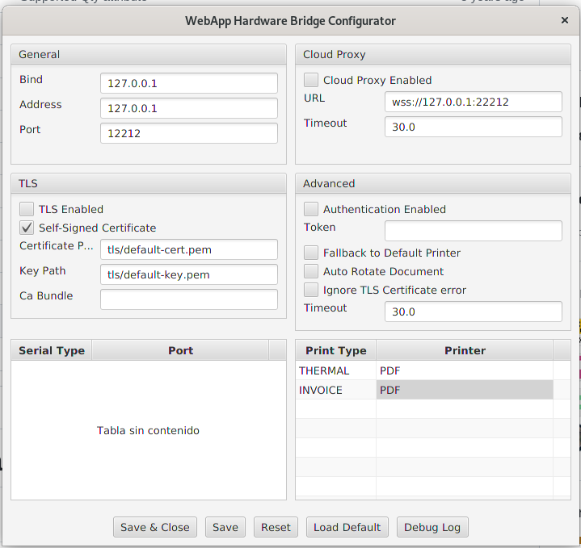
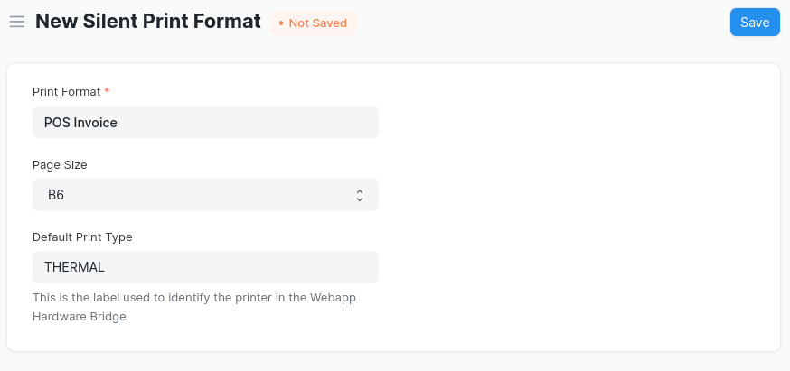

## Silent Print

This is a Frappe App for printing documents silently, that is, without having to interact with browser's print dialog and send the printing order directly to the printer.

This is achieved using the tool called [Webapp Hardware Bridge](https://github.com/imTigger/webapp-hardware-bridge).

## Funtionality

So far, this app covers the following scenarios:
1. Printing from standard Point of Sale (POS)
2. Printing from any document via Custom Script

## How to use it

First, install the Webapp Hardware Bridge in the computer which has conection to the printers.

### Instalation in Windows
1. Go to the [realeses' page](https://github.com/imTigger/webapp-hardware-bridge/releases) and download the last version's .exe (in this case it is v0.14.0). 
2. Run the file.

### Configuration
After the instalation finnishes, in the Windows home panel, search for the Webapp Hardware Bridge Configurator.


Go to the printer section and set a Print Type (which works like a label to identify a Printer) and then select a printer connected to your computer.

Then, click "Save & Close".

The server will be running in the background listening for websocket connections.

### Configuration in Frappe/ERPNext
Go to the awesome bar and type "Silent Print Format". Go for it and create a new one. Fill the form with this fields:
1. Print Format
2. Page size: select the paper size (as defined in [QT](https://doc.qt.io/archives/qt-4.8/qprinter.html#PaperSize-enum)). You can also select a Custom size and then will apper two fields to set the width and the height in mm.
3. Default Print Type: This allows the Point of Sale (POS) to know to which printer to print. It's the label used to identify the printer you set in the Webapp Hardware Bridge's Configurator.

Here is an example:


### Using in POS
To use this app in Point of Sales (POS), do:
1. Go to a POS Profile
2. In the Print Setting section, set the Print Format you selected in the Silent Print Format.

This implies that this Print Format will print silently when this POS Profile is used in the Point of Sale.
That is, after you completed the order, you can "Print Receipt" and it will print silently (i.e. without interacting with the browser's print dialog).

### Printing from any document via Custom Script
To be able to print form any document, follow these steps:
1. Create a New Custom Script
2. Select the Doctype (e.g. Sales Invoice); "Apply To" = "Form"; "Enabled" = "on"
3. Copy and paste the following code:
```
frappe.ui.form.on('Sales Invoice', {
	refresh(frm) {
		frm.add_custom_button('PRINT SILENTLY', () => {send2bridge(frm, "POS Invoice")})
	}
})

var send2bridge = function (frm, print_format, print_type = "THERMAL"){
    var printService = new WebSocketPrinter();
	frappe.call({
		method: 'silent_print.utils.print_format.create_pdf',
		args: {
			doctype: frm.doc.doctype,
			name: frm.doc.name,
			silent_print_format: print_format,
			no_letterhead: 1,
			_lang: "es"
		},
		callback: (r) => {
		    console.log(r)
			printService.submit({
				'type': print_type,
				'url': 'file.pdf',
				'file_content': r.message.pdf_base64
			});
		}
	})
}

function WebSocketPrinter (options) {
    var defaults = {
        url: "ws://127.0.0.1:12212/printer",
        onConnect: function () {
        },
        onDisconnect: function () {
        },
        onUpdate: function () {
        },
    };

    var settings = Object.assign({}, defaults, options);
    var websocket;
    var connected = false;

    var onMessage = function (evt) {
        settings.onUpdate(evt.data);
    };

    var onConnect = function () {
        connected = true;
        settings.onConnect();
    };

    var onDisconnect = function () {
        connected = false;
        settings.onDisconnect();
        reconnect();
    };
    
    var onError = function () {
        if (frappe.whb == undefined){
            frappe.msgprint("The connection to the printer cannot be established. Please verify that the <a href='https://github.com/imTigger/webapp-hardware-bridge' target='_blank'>WebApp Hardware Bridge</a> is running.")
            frappe.whb = true
        }
    };

    var connect = function () {
        websocket = new WebSocket(settings.url);
        websocket.onopen = onConnect;
        websocket.onclose = onDisconnect;
        websocket.onmessage = onMessage;
        websocket.onerror = onError;
    };

    var reconnect = function () {
        connect();
    };

    this.submit = function (data) {
        if (Array.isArray(data)) {
            data.forEach(function (element) {
                websocket.send(JSON.stringify(element));
            });
        } else {
            websocket.send(JSON.stringify(data));
        }
    };

    this.isConnected = function () {
        return connected;
    };

    connect();
}
```

This creates a custom button and send the print order to the bridge, via web socket.

## Comming features
1. Print to multiple printers
2. Print from any device

#### License

MIT